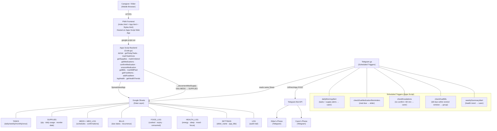
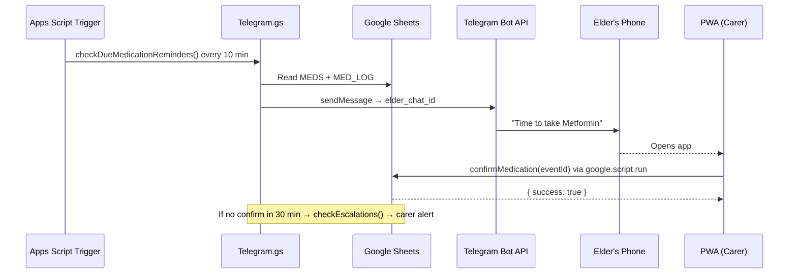

# ElderCare Architecture

ElderCare is a mobile-first PWA and Telegram bot system for tracking an elderly parent's daily care tasks, medication schedules, supplement reordering, bill payments, food expiry, and health metrics — with Google Sheets as the data layer and Google Apps Script as the backend and host.

## Component Summary

| Component | Role |
|---|---|
| `phase1/setup.gs` | One-time setup: creates all Sheet tabs with headers and seed data |
| `phase2/Code.gs` | Apps Script backend — serves PWA via `doGet`, exposes all data API functions |
| `phase2/Index.html` | PWA shell with tab navigation (Tasks, Supplies, Meds, Bills, Food, Health) |
| `phase2/App.html` | Frontend JS — calls `google.script.run`, renders UI, handles swipe-to-complete |
| `phase2/Styles.html` | Mobile-first CSS, swipe animations, status colour coding |
| `phase3/Telegram.gs` | Scheduled trigger handlers that read the Sheet and push alerts via Telegram Bot API |
| Google Sheets | Persistent data store — TASKS, SUPPLIES, MEDS, MED_LOG, BILLS, FOOD_LOG, HEALTH_LOG, SETTINGS, LOG |
| Telegram Bot API | Delivers push notifications to elder's phone and carer's phone |

## Data Flow — Medication Reminder

